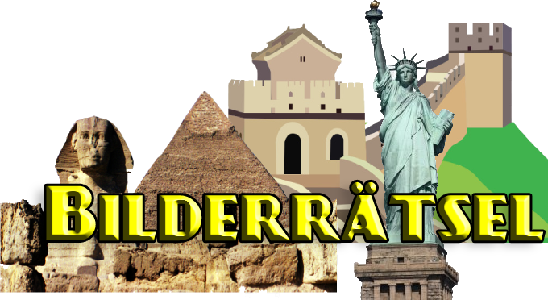

# Bilderrätsel

<div align="center">

</div>

An Android picture puzzle app written in Kotlin, containing a set of questions to answer and different themes to choose from.
Statistics will be stored and achievements can be unlocked, creation of new themes or modifications to it are also possible.

**In order to access the app, you will need a _Google accout_**

## Installation
Clone this repository and import into **Android Studio**
```bash
git clone git@git.thm.de:android-ws20/bilderraetsel.git
```

## Build variants
Use the Android Studio *Build Variants* button to choose between **production** and **staging** flavors combined with **debug** and **release** build types

## Technologies 

Technologies used to create this app :

* Android SDK 30
* Cloud Firestore
* Firebase Storage
* Firebase Authentication
* Android Jetpack Navigation
* [Circular ImageView](https://github.com/hdodenhof/CircleImageView)
* [Glide](https://github.com/bumptech/glide)

## Maintainers
This project is mantained by:
* [Khaled Trabelsi](https://git.thm.de/ktrb56)
* [Simon Schniedenharn](https://git.thm.de/ssnd94)
* [Anwar Miled](https://git.thm.de/amld78)
* [Ahmed Rafaa](https://git.thm.de/arfa97)

